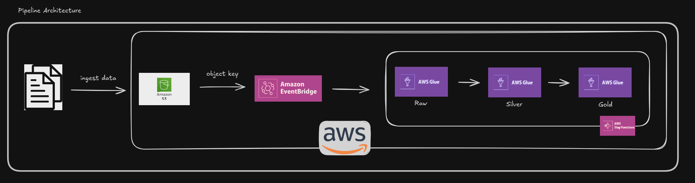

# Glue Archicture 

# Goal

Main goal is create a pipeline with glue, orcastred with step functions. 

Create pipeline that are triggered when have ingest data on S3.

Something link that:


## Ocult files:
**provider.tf**
example:
```bash
terraform {
  required_providers {
    aws = {
      source  = "hashicorp/aws"
      version = "~> 4.0"
    }
  }
    backend "s3" {
    bucket         = ""
    key            = ""
    region         = ""
    profile        = ""
  }
}
```

**.env**
example:

```bash

```


## TODO:

-> Formato padrão Readme.
-> Configuração de conta AWS básico.
-> Criar Bucket do tfstate com bash ou Ansible também. Habilitar Versionamento no bucket.

